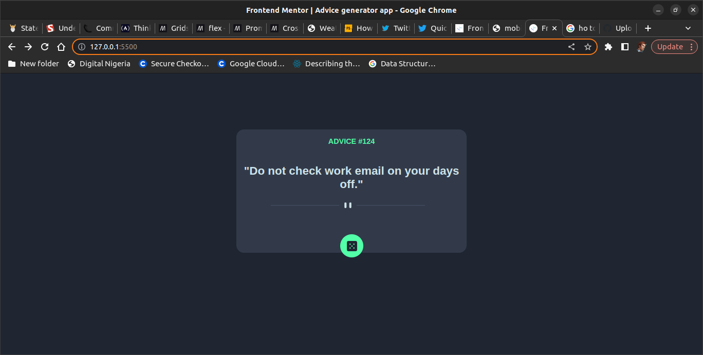

# Frontend Mentor - Advice generator app solution

This is a solution to the [Advice generator app challenge on Frontend Mentor](https://www.frontendmentor.io/challenges/advice-generator-app-QdUG-13db). Frontend Mentor challenges help you improve your coding skills by building realistic projects.

## Table of contents

- [Overview]An advice generator app with Fetch API
  - [The challenge] Build an advice generator app
  - [Screenshot](#screenshot)
  - [Links]
- [My process](#my-process)
  - [Built with] HTML, CSS and JavaScript
  - [What I learned]I learnt to get data from an API
  - [Continued development]
  - [Useful resources]The Odin Project 
- [Author]Iwegbu Jedidiah
-

### Screenshot

### Links

- Solution URL: [Add solution URL here](https://your-solution-url.com)
- Live Site URL: [Add live site URL here](https://your-live-site-url.com)

## My process

### Built with

- Semantic HTML5 markup
- CSS custom properties
- Flexbox
- Fetch API

### What I learned

I learnt how to fetch data from an API

#
## Author

- Frontend Mentor - [@yourusername](https://www.frontendmentor.io/profile/yourusername)
- Twitter - [@Hashkitti0](https://www.twitter.com/Hashkitti0)
